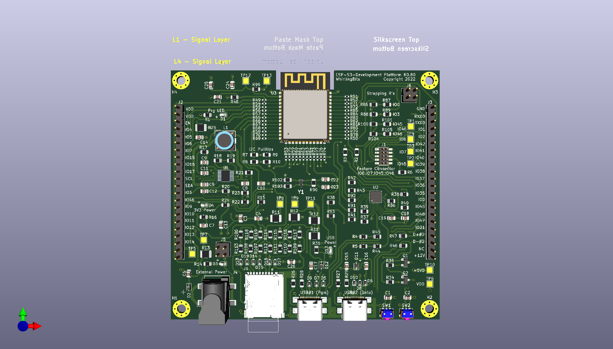
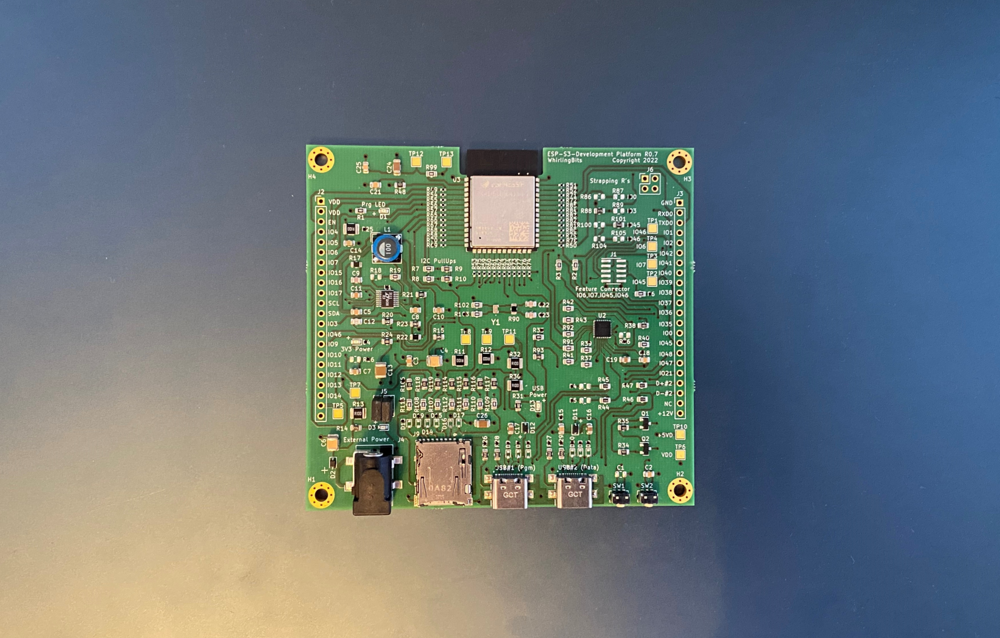

# ESP_Platform_Schematic

## Description
Schematics of basic ESP32-S3-WROOM platform with versatile power management
for 12V and 5V supply and microSD card slot.
The board offers 2 USB-C receptables, one connecting to a USB-2-UART converter
(CP2102) feeding the genuine UART0 on ESP32-S3 and another directly connecting
to the ESP32-S3's USB OTG port.

## Power Management
The board may be powered by one of the USB ports (VBUS) or with an external
power supply connected via BarrelJack. So altogether there are 3 possible sources of
power, USB (PGM), USB (Data) and Ext. To prevent any currents flowing from the
source with higher voltage to a source with lower voltage Schotty diodes with
low treshold have been implemented.

Thanx to the buck/boost capability of the LTC3111 used the external power input
voltage may supply a voltage between 3..15V.

Alternatively it is possible to use an external battery controller (e.g. Sparkfun
Babysitter) which is connected on J5 whereas J5.4 (+5VD) will be the input for the
controller and J5.1,2 the output.

## Wifi/BT module from Espressif
For the module we have chosen an ESP32-S3-WROOM-1 from Espressif with 8MByte
serial FLASH and 8MByte PSRAM (suffix -N8R8). ESP32-S3 is more powerful than
classical ESP32-D0WD as its using Dual Core Tensilica LX7 with an augmented 
instruction set supporting low level calculations for CNN processing (tinyML).
For precision of all time related processes there's an clock crystal (32kHz)
assembled.

And this is the real board:

## CAE System
Schematics and Layout have been developed using KiCAD 5.x version. You may
just download the complete repository to a folder inside your KiCAD project
directories to start using it.
